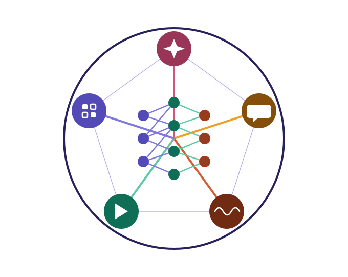

# MSCS 435/635 — Advanced Machine Learning

<p align="left">
  
</p>

**Fall 2026 · TTH 9:40 AM – 11:05 AM (JHSW 103)**
**Instructor:** Dr. Augustine Twumasi ([twumasia@uwstout.edu](mailto:twumasia@uwstout.edu))

---

## About This Course

Deep learning systems are increasingly central to modern AI, powering applications from generative models to language understanding and autonomous decision-making. This course covers modern machine learning architectures, with hands-on applications to computer vision, generative modeling, sequence modeling, and natural language processing.

Topics include convolutional and residual neural networks, generative architectures (VAEs, GANs, diffusion models), sequence and attention models (RNNs, LSTMs, Transformers), word embeddings, large language models, retrieval-augmented generation, and reinforcement learning and tree search (multi-armed bandits, Q-learning, Monte Carlo Tree Search, AlphaGo).

By the end of the course, students will be able to implement these architectures directly and will be well positioned to understand and extend their knowledge through current research literature.

📄 [Full Syllabus](syllabus/MSCS_435_635_Syllabus.pdf) · 📅 [Course Schedule](schedule.md) · 📚 [Resources](resources/resources.md)

---

## Course Sections

1. **Foundations of Deep Learning** — backpropagation, optimization, regularization, the vanishing gradient problem
2. **Computer Vision** — CNNs, ResNets, classification, detection, segmentation, ViT
3. **Generative Modeling** — VAEs, GANs, diffusion models
4. **Sequence and Attention Modeling** — RNNs, LSTMs, GRUs, attention, Transformers
5. **Natural Language Processing and Foundation Models** — embeddings, LLMs, fine-tuning, prompting, RAG
6. **Reinforcement Learning and Decision Making** — MDPs, bandits, Q-learning, MCTS, AlphaGo

## Repository Structure

```
├── syllabus/       official syllabus (PDF)
├── schedule.md     week-by-week schedule
├── slides/         lecture slides, organized by week
├── homework/       paper homework sets
├── code/      starter notebooks (open directly in Colab)
├── projects/       project guidelines and checkpoint rubrics
├── resources/      textbooks, courses, and background reading
└── assets/         logo and other site assets
```

## Grading

| Category | Weight |
|---|---|
| Class activities and participation | 10% |
| Paper homework | 10% |
| Midterm exam | 15% |
| Projects (3, spaced across the semester) | 65% |

Full grading policies, including the late-work policy, are in the [syllabus](syllabus/MSCS_435_635_Syllabus.pdf).

## Office Hours

In office (JHSW 234G) or via Teams — see the [syllabus](syllabus/MSCS_435_635_Syllabus.pdf) for the current schedule, or stop by during any posted student hours.

---


